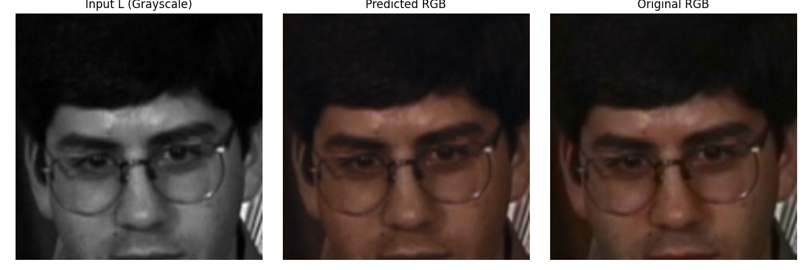
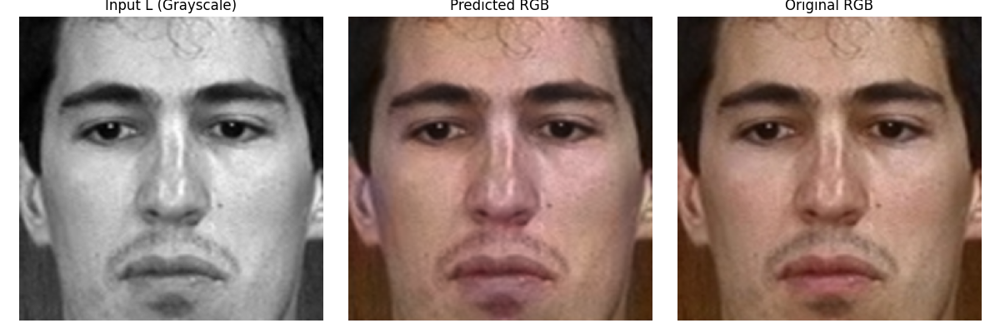
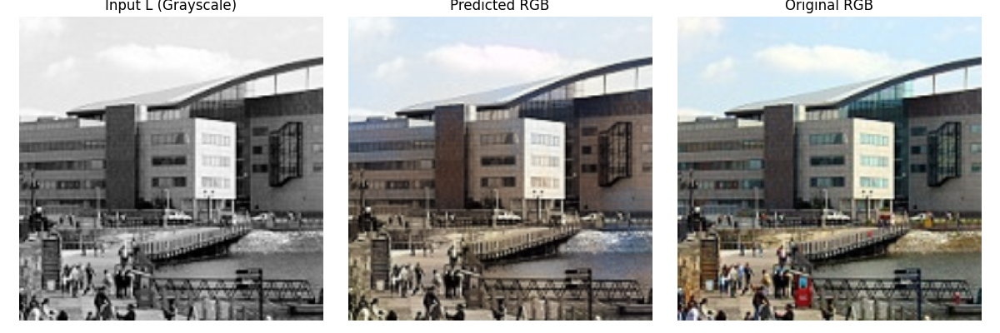

# Colouring Grayscale Images 
This project focuses on using deep learning, specifically a convolutional encoder-decoder model, to bring colour back to grayscale images. The primary objective is to train a model that can restore the natural appearance of faces in the dataset by predicting realistic and believable colours. The convolutional encoder-decoder architecture enables the model to capture both the global context and the fine details required for effective colourisation. The model is primarily trained on a dataset of facial images using the LAB colour space. This approach allows the model to concentrate on learning the colour components (AB channels) while preserving the structure from the grayscale image (L channel).
To build upon the core model, we also explore adversarial learning to encourage the network to produce sharper and more visually convincing results. In addition, we experiment with training the model on a landscape dataset and analyse how different CNN configurations affect performance. These extensions provide deeper insights into how various architectures and learning strategies influence the quality of colourisation, both visually and quantitatively.

### Goals:
* Train a model that can add colour to grayscale images in a realistic and consistent way.
* Explore how a learning technique affects the quality of results.
* Evaluate outputs both quantitatively and visually.
* Gain insights into how neural networks learn visual semantics from data.
* Investigate different datasets.

## Project structure

```plaintext
project_root/
│
├── data/                          # Scripts and loaders for datasets
│   └── datasets.py                # Custom PyTorch Dataset and DataLoader
│   └── face_images                # Face images dataset 
├── models/                        # Model definitions
│   ├── conv_autoencoder.py        # Main convolutional encoder-decoder model
│   ├── adv_generator.py           # Adversarial learning
├── results/                       # Generated results on the test set (images)
├── utils/                     
│   └── utils.py                   # Metric functions and visualisations 
├── README.md                      # Project overview and usage instructions
├── main.py                        # Main script for training/testing model
├── model_configurations_tests.py  # Different configurations test
├── requirements.txt               # Python dependencies


```

## Usage instructions 

This project trains a deep learning model to colourise grayscale images using primarily a convolutional autoencoder. It supports tracking with [Weights & Biases](https://wandb.ai/site)  for monitoring training.

First clone the repository to your local machine:
```
git clone https://github.com/AlessandroFornara/Deep_Learning_Project_UAB.git
cd Deep_Learning_Project_UAB
```

Run the following commands to create and activate the environment:
```
conda create --name colorization-project python=3.10.14
conda activate colorization-project
pip install -r requirements.txt --extra-index-url https://download.pytorch.org/whl/cu121
```
Once the environment is set up, you can start training with:
```
python main.py
```
Inside `main.py`, you can control the experiment by setting:

- **Model architecture**: choose between `Conv_Autoencoder` or `Gen_Adv` (Adversarial Generator / GAN)
- **Dataset**: select `Faces` or `Landscapes`
- **Loss function** (for Autoencoder): use `MSE` or `L1`

Training progress and metrics will be automatically logged to **Weights & Biases (wandb)** for visualization and tracking.

## Evaluation Metrics

The following metrics are used to evaluate colourisation quality:

- **MSE (Mean Squared Error)**: Measures the average squared difference between predicted and ground truth pixel values.
- **PSNR (Peak Signal-to-Noise Ratio)**: Reflects the quality of the reconstructed image compared to the original; higher is better.
- **SSIM (Structural Similarity Index)**:  Evaluates perceived image quality based on structural information.
- **DeltaE**: Measures perceptual colour difference based on human vision; lower values indicate better colour accuracy.

## Results and analysis  

### Convolutional encoder-decoder architecture on face dataset:

The visual results on the test facial dataset using the convolutional encoder-decoder architecture are shown in the image below. The image displays the model’s input (grayscale), the model’s prediction, and the ground truth image.



It can be observed that the model performs well, producing colourised images that effectively capture variations across different regions while preserving important structural details. Minor visual imperfections, such as slight misalignments in colour and a brownish tint in some areas, are present but do not significantly detract from the overall quality. Notably, the model does not simply apply a uniform filter but makes a genuine attempt to reproduce diverse and natural colours.
Quantitatively, the results are strong, as shown in the table below:

| Model                       | PSNR  | SSIM | DeltaE | MSE    |
|-----------------------------|-------|------|--------|--------|
| CNN Encoder-Decoder (Faces) | 31.18 | 0.98 | 4.16   | 0.0013 |

These results demonstrate the model’s strong performance across all metrics, reflecting its ability to accurately and consistently restore colour to grayscale facial images. The low MSE and high PSNR (considered good when above 30 dB) indicate that the predicted images closely match the ground truth, while the high SSIM score (above 0.95 indicates good preservation of structural details) confirms the model’s effectiveness in preserving structural details. The low DeltaE (values below 5 considered very good for colour accuracy) further indicates that the predicted colours are perceptually close to the real colours.

### Adversarial learning on face dataset:

The visual results on the facial dataset using the adversarial learning approach are shown in the image below, which is an example from the test set. The image displays the model’s input (grayscale), the model’s prediction, and the ground truth image.



It can be observed that the model performs well with the application of adversarial learning, producing colourisations that are generally clear and consistent, and that capture variations across different regions. The colour reproduction is effective, and key structural details are well preserved. While some minor visual imperfections remain, the model demonstrates a strong capability in restoring natural colours to grayscale images.
Quantitatively, the results can be summarised as follows: 

| Model                         | PSNR  | SSIM | DeltaE | MSE    |
|-------------------------------|-------|------|--------|--------|
| Adversarial  Learning (Faces) | 29.37 | 0.98 | 5.53   | 0.0016 |

The results also confirm the effectiveness of the adversarial learning approach in producing colourisations. The SSIM indicates a strong alignment of structural details with the ground truth, while the PSNR and low MSE reflect a close match between predicted and original images. Although the DeltaE value is slightly higher, it remains within an acceptable range (perceptible at a glance), indicating the model’s capability to approximate true colours in grayscale-to-colour conversions. Overall, adversarial learning has proven to be a viable method for achieving consistent and accurate colourisation results.


### Convolutional encoder-decoder architecture on landscape images:

Finally, we evaluate the encoder-decoder architecture on landscape images, with the results shown below



This shows that the model, although architecturally limited for more complex images, captures and colourises in the right direction. However, the results are not as good as those we produced with the face dataset. There are more regions that are colored incorrectly, and some test images (as seen in the results folder) do not correspond well at all.

Quantitatively, the results can be summarised as follows: 

| Model                            | PSNR  | SSIM | DeltaE | MSE    |
|----------------------------------|-------|------|--------|--------|
| CNN Encoder-Decoder (Landscapes) | 22.90 | 0.94 | 12.00  | 0.0070 |

The CNN encoder-decoder model, when applied to landscape images, achieved a PSNR of 22.90 and an SSIM of 0.94, indicating a moderate level of reconstruction quality and structural similarity. The DeltaE of 12 shows a noticeable colour difference from the ground truth, suggesting that the model struggles more with capturing accurate colors in complex scenes compared to faces. The relatively higher MSE of 0.007 further reflects the model’s difficulty in precisely matching pixel values for detailed and varied landscapes.


### Final reflection and comparison:
This project has explored the use of convolutional encoder-decoder models and (additionally) adversarial learning techniques for grayscale image colourisation. The encoder-decoder model provided a solid foundation, while adversarial learning introduced sharper and more natural-looking visual results. Although the differences between the models in terms of quantitative metrics were minimal, both approaches successfully addressed the colourisation task.

The results of the CNN encoder-decoder architecture highlight the limitations of the model (initially designed for face images) in capturing more complex structures and colour variations. While the models applied to the dataset are not perfect, they effectively achieve the intended objective. Furthermore, the code supports running different configurations (e.g., variations in learning rate, weight decay, and loss functions) for the CNN encoder-decoder, offering flexibility to experiment and fine-tune the model’s performance.

## Datasets 

The datasets that were used for this project are:
* https://www.kaggle.com/datasets/theblackmamba31/landscape-image-colorization
* https://github.com/2014mchidamb/DeepColorization/tree/master/face_images

## Contributors 
 - [Frederik Evenepoel](https://github.com/FrederikEvenepoel)
 - [Alessandro Fornara](https://github.com/AlessandroFornara)
 - [Lorenzo Munoz Hernandez](https://github.com/lolenn10) 

Neural Networks and Deep Learning
BSc Artificial Intelligence
UAB, 2025
